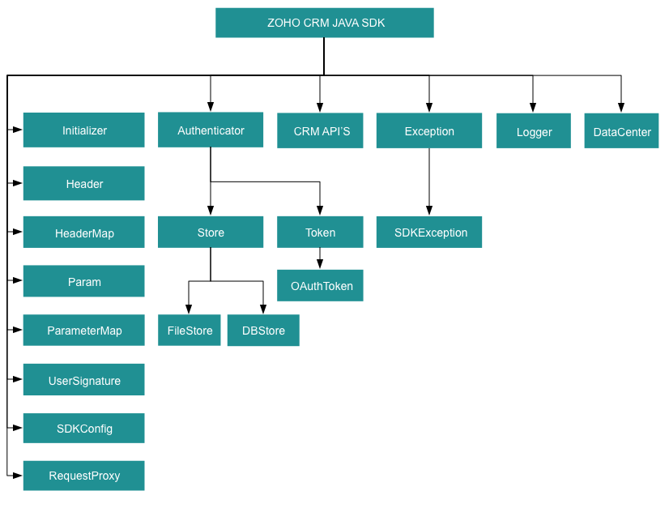

# Archival Notice:

$${\color{red}This \space version \space of \space SDK \space is \space archived}$$. You can continue to use it, but no new features or support requests will be accepted. We recommend using our latest [SDK version](https://www.zoho.com/crm/developer/docs/sdk/server-side/java-sdk.html).

## Table Of Contents

* [Overview](#overview)
* [Registering a Zoho Client](#registering-a-zoho-client)
* [Environmental Setup](#environmental-setup)
* [Including the SDK in your project](#including-the-sdk-in-your-project)
* [Using the Java SDK for Zoho CRM through Maven
](#using-the-java-sdk-for-zoho-crm-through-maven
)
* [Persistence](#token-persistence)
  * [DataBase Persistence](#database-persistence)
  * [File Persistence](#file-persistence)
  * [Custom Persistence](#custom-persistence)
* [Configuration](#configuration)
* [Initialization](#initializing-the-application)
* [Class Hierarchy](#class-hierarchy)
* [Responses And Exceptions](#responses-and-exceptions)
* [Threading](#threading-in-the-java-sdk)
  * [Multithreading in a Multi-User App](#multithreading-in-a-multi-user-app)
  * [Multi-threading in a Single User App](#multi-threading-in-a-single-user-app)
* [Sample Code](#sdk-sample-code)

## Overview

Zoho CRM JAVA SDK offers a way to create client Java applications that can be integrated with Zoho CRM.

## Registering a Zoho Client

Since Zoho CRM APIs are authenticated with OAuth2 standards, you should register your client app with Zoho. To register your app:

- Visit this page [https://api-console.zoho.com/](https://api-console.zoho.com)

- Click `ADD CLIENT`.

- Choose a `Client Type`.

- Enter **Client Name**, **Client Domain** or **Homepage URL** and **Authorized Redirect URIs**. Click `CREATE`.

- Your Client app will be created and displayed.

- Select the created OAuth client.

- Generate grant token by providing the necessary scopes, time duration (the duration for which the generated token is valid) and Scope Description.

## Environmental Setup

JAVA SDK requires Java (version 8 and above) to be set up in your development environment.

## Including the SDK in your project

Java SDK is available through Maven distribution. You can include the SDK to your project using:

1. Maven

    - pom.xml file.

    ```xml
    <repositories>
        <repository>
            <id>java-sdk</id>
            <url>https://maven.zohodl.com</url>
        </repository>
    </repositories>
    <dependencies>
        <dependency>
            <groupId>com.zoho.crm</groupId>
            <artifactId>java-sdk</artifactId>
            <version>3.0.1</version>
        </dependency>
    </dependencies>
    ```

2. Gradle

    ```gradle
    repositories{
        maven { url "https://maven.zohodl.com" }
    }
    dependencies{
        implementation 'com.zoho.crm:java-sdk:3.0.1'
    }
     ```

3. Downloadable JARs ([by Zoho](https://www.zoho.com/sites/default/files/crm/zcrmsdk-3.0.1.zip))

### Dependency JARs

[commons-lang3-3.9.jar](https://mvnrepository.com/artifact/org.apache.commons/commons-lang3/3.9)

[commons-logging-1.1.3.jar](https://mvnrepository.com/artifact/commons-logging/commons-logging/1.1.3)

[httpclient-4.4.1.jar](https://mvnrepository.com/artifact/org.apache.httpcomponents/httpclient/4.4.1)

[httpcore-4.4.4.jar](https://mvnrepository.com/artifact/org.apache.httpcomponents/httpcore/4.4.4)

[httpmime-4.5.3.jar](https://mvnrepository.com/artifact/org.apache.httpcomponents/httpmime/4.5.3)

[json-20170516.jar](https://mvnrepository.com/artifact/org.json/json/20170516)

[mysql-connector-java-5.1.47-bin.jar](https://mvnrepository.com/artifact/mysql/mysql-connector-java/5.1.47)

[opencsv-5.0.jar](https://mvnrepository.com/artifact/com.opencsv/opencsv/5.0)

## Using the Java SDK for Zoho CRM through Maven

Follow the below steps to use the Java SDK for Zoho CRM through Maven.

- Create a Maven project.

- Place the below code in your pom.xml file of your Maven project.

    ```xml
    <repositories>
        <repository>
            <id>java-sdk</id>
            <url>https://maven.zohodl.com</url>
        </repository>
    </repositories>
    <dependencies>
        <dependency>
            <groupId>com.zoho.crm</groupId>
            <artifactId>java-sdk</artifactId>
            <version>3.0.1</version>
        </dependency>
    </dependencies>
    ```

- Update the maven project.
  - Under project explorer, right-click the project name, select **Maven** > **Update Project**. The jar will be downloaded in the maven dependencies.

- Inside your source code, import the appropriate files from the SDK.

- Generate the grant token when you initialize your application.

## Token Persistence

Token persistence refers to storing and utilizing the authentication tokens that are provided by Zoho. There are three ways provided by the SDK in which persistence can be utilized. They are DataBase Persistence, File Persistence, and Custom Persistence.

### Table of Contents

- [DataBase Persistence](#database-persistence)

- [File Persistence](#file-persistence)

- [Custom Persistence](#custom-persistence)

### Implementing OAuth Persistence

Once the application is authorized, OAuth access and refresh tokens can be used for subsequent user data requests to Zoho CRM. Hence, they need to be persisted by the client app.

The persistence is achieved by writing an implementation of the inbuilt **[TokenStore](src/main/java/com/zoho/api/authenticator/store/TokenStore.java) interface**, which has the following callback methods.

- **getToken([UserSignature](resources/UserSignature.md#usersignature) user, [Token](src/main/java/com/zoho/api/authenticator/Token.java) token)** - invoked before firing a request to fetch the saved tokens. This method should return an implementation of **Token interface** object for the library to process it.

- **saveToken([UserSignature](resources/UserSignature.md#usersignature) user, [Token](src/main/java/com/zoho/api/authenticator/Token.java) token)** - invoked after fetching access and refresh tokens from Zoho.

- **deleteToken([Token](src/main/java/com/zoho/api/authenticator/Token.java) token)** - invoked before saving the latest tokens.

- **getTokens()** - The method to retrieve all the stored tokens.

- **deleteTokens()** - The method to delete all the stored tokens.

### DataBase Persistence

In case the user prefers to use the default DataBase persistence, **MySQL** can be used.

- The database name should be **zohooauth**.

- There must be a table named **oauthtoken** with the following columns.

  - id int(11)
  
  - user_mail varchar(255)

  - client_id varchar(255)

  - refresh_token varchar(255)

  - access_token varchar(255)

  - grant_token varchar(255)

  - expiry_time varchar(20)

#### MySQL Query

```sql
create table oauthtoken(id int(11) not null auto_increment, user_mail varchar(255) not null, client_id varchar(255), refresh_token varchar(255), access_token varchar(255), grant_token varchar(255), expiry_time varchar(20), primary key (id));

alter table oauthtoken auto_increment = 1;
```

#### Create DBStore object

```java
/*
* 1 -> DataBase host name. Default value "localhost"
* 2 -> DataBase name. Default  value "zohooauth"
* 3 -> DataBase user name. Default value "root"
* 4 -> DataBase password. Default value ""
* 5 -> DataBase port number. Default value "3306"
*/
TokenStore tokenstore = new DBStore();
//TokenStore interface
TokenStore tokenstore = new DBStore("hostName", "dataBaseName", "userName", "password", "portNumber");
```

### File Persistence

In case of File Persistence, the user can persist tokens in the local drive, by providing the the absolute file path to the FileStore object.

- The File contains.

  - user_mail

  - client_id

  - refresh_token

  - access_token

  - grant_token

  - expiry_time

#### Create FileStore object

```java
//Parameter containing the absolute file path to store tokens
TokenStore tokenstore = new FileStore("/Users/user_name/Documents/java_sdk_token.txt");
```

### Custom Persistence

To use Custom Persistence, the user must implement **TokenStore interface**(**com.zoho.api.authenticator.store.TokenStore**) and override the methods.

```java
package store;

import com.zoho.api.authenticator.Token;

import com.zoho.crm.api.exception.SDKException;

import com.zoho.crm.api.UserSignature;

import com.zoho.api.authenticator.store.TokenStore;

public class CustomStore implements TokenStore
{
    /**
        * @param user A UserSignature class instance.
        * @param token A Token (com.zoho.api.authenticator.OAuthToken) class instance.
        * @return A Token class instance representing the user token details.
        * @throws SDKException if any problem occurs.
    */
    @Override
    public Token getToken(UserSignature user, Token token) throws SDKException
    {
        // Add code to get the token
        return null;
    }

    /**
        * @param user A UserSignature class instance.
        * @param token A Token (com.zoho.api.authenticator.OAuthToken) class instance.
        * @throws SDKException if any problem occurs.
    */
    @Override
    public void saveToken(UserSignature user, Token token) throws SDKException
    {
        // Add code to save the token
    }

    /**
        * @param token A Token (com.zoho.api.authenticator.OAuthToken) class instance.
        * @throws SDKException if any problem occurs.
    */
    @Override
    public void deleteToken(Token token) throws SDKException
    {
        // Add code to delete the token
    }

    @Override
    public void getTokens() throws SDKException
    {
        // Add code to get the all stored tokens
    }

    @Override
    public void deleteTokens() throws SDKException
    {
        // Add code to delete the all stored token
    }
}
```

## Configuration

Before you get started with creating your Java application, you need to register your client and authenticate the app with Zoho.

- Create an instance of **[Logger](resources/logger/Logger.md#logger)** Class to log exception and API information.

    ```java
    /*
        * Create an instance of Logger Class that takes two parameters
        * 1 -> Level of the log messages to be logged. Can be configured by typing Levels "." and choose any level from the list displayed.
        * 2 -> Absolute file path, where messages need to be logged.
    */
    Logger logger = Logger.getInstance(Levels.INFO, "/Users/user_name/Documents/java_sdk_log.log");
    ```

- Create an instance of **[UserSignature](resources/UserSignature.md#usersignature)** that identifies the current user.

    ```java
    //Create an UserSignature instance that takes user Email as parameter
    UserSignature user = new UserSignature("abc@zoho.com");
    ```

- Configure API environment which decides the domain and the URL to make API calls.

    ```java
    /*
        * Configure the environment
        * which is of the pattern Domain.Environment
        * Available Domains: USDataCenter, EUDataCenter, INDataCenter, CNDataCenter, AUDataCenter
        * Available Environments: PRODUCTION, DEVELOPER, SANDBOX
    */
    Environment environment = USDataCenter.PRODUCTION;
    ```

- Create an instance of **[OAuthToken](resources/token/OAuthToken.md#oauthtoken)** with the information  that you get after registering your Zoho client.

    ```java
    /*
        * Create a Token instance
        * 1 -> OAuth client id.
        * 2 -> OAuth client secret.
        * 3 -> REFRESH/GRANT token.
        * 4 -> Token type(REFRESH/GRANT).
        * 5 -> OAuth redirect URL.
    */
    //Token token = new OAuthToken("clientId", "clientSecret", "REFRESH/GRANT token", TokenType.REFRESH/GRANT);

    Token token = new OAuthToken("clientId", "clientSecret", "REFRESH/GRANT token", TokenType.REFRESH/GRANT, "redirectURL");
    ```

- Create an instance of **[TokenStore](src/main/java/com/zoho/api/authenticator/store/TokenStore.java)** to persist tokens that are  used for authenticating all the requests.

    ```java
    /*
        * Create an instance of TokenStore.
        * 1 -> DataBase host name. Default "localhost"
        * 2 -> DataBase name. Default "zohooauth"
        * 3 -> DataBase user name. Default "root"
        * 4 -> DataBase password. Default ""
        * 5 -> DataBase port number. Default "3306"
    */
    //TokenStore tokenstore = new DBStore();

    TokenStore tokenstore = new DBStore("hostName", "dataBaseName", "userName", "password", "portNumber");

    //TokenStore tokenstore = new FileStore("/Users/user_name/Documents/java_sdk_token.txt");

    //TokenStore tokenStore = new CustomStore();
    ```

- Create an instance of **[SDKConfig](resources/SDKConfig.md)** containing the SDK configuration.

    ```java
    /*
    * autoRefreshFields
    * if true - all the modules' fields will be auto-refreshed in the background, every hour.
    * if false - the fields will not be auto-refreshed in the background. The user can manually delete the file(s) or refresh the fields using methods from ModuleFieldsHandler(com.zoho.crm.api.util.ModuleFieldsHandler)
    *
    * pickListValidation
    * A boolean field that validates user input for a pick list field and allows or disallows the addition of a new value to the list.
    * true - the SDK validates the input. If the value does not exist in the pick list, the SDK throws an error.
    * false - the SDK does not validate the input and makes the API request with the user’s input to the pick list
    */
    SDKConfig sdkConfig = new SDKConfig.Builder().setAutoRefreshFields(false).setPickListValidation(true).build();
    ```

- The path containing the absolute directory path to store user-specific files containing module fields information.

    ```java
    String resourcePath = "/Users/user_name/Documents/javasdk-application";
    ```

- Create an instance of **[RequestProxy](resources/RequestProxy.md)** containing the proxy properties of the user.

    ```java
    RequestProxy RequestProxy = new RequestProxy("proxyHost", "proxyPort", "proxyUser", "password", "userDomain");
    ```

## Initializing the Application

Initialize the SDK using the following code.

```java
package com.zoho.crm.sample.initializer;

import com.zoho.api.authenticator.OAuthToken;
import com.zoho.api.authenticator.Token;
import com.zoho.api.authenticator.OAuthToken.TokenType;
import com.zoho.api.authenticator.store.DBStore;
import com.zoho.api.authenticator.store.TokenStore;

import com.zoho.crm.api.Initializer;
import com.zoho.crm.api.RequestProxy;
import com.zoho.crm.api.UserSignature;
import com.zoho.crm.api.dc.DataCenter.Environment;
import com.zoho.crm.api.dc.USDataCenter;
import com.zoho.api.logger.Logger;
import com.zoho.api.logger.Logger.Levels;
import com.zoho.crm.api.SDKConfig;


public class Initialize
{
    public static void main(String[] args) throws Exception
    {
        initialize();
    }
    public static void initialize() throws Exception
    {
        /*
        * Create an instance of Logger Class that takes two parameters
        * 1 -> Level of the log messages to be logged. Can be configured by typing Levels "." and choose any level from the list displayed.
        * 2 -> Absolute file path, where messages need to be logged.
        */
        Logger logger = Logger.getInstance(Levels.INFO, "/Users/user_name/Documents/java_sdk_log.log");

        //Create an UserSignature instance that takes user Email as parameter
        UserSignature user = new UserSignature("abc@zoho.com");

        /*
        * Configure the environment
        * which is of the pattern Domain.Environment
        * Available Domains: USDataCenter, EUDataCenter, INDataCenter, CNDataCenter, AUDataCenter
        * Available Environments: PRODUCTION, DEVELOPER, SANDBOX
        */
        Environment environment = USDataCenter.PRODUCTION;

        /*
        * Create a Token instance
        * 1 -> OAuth client id.
        * 2 -> OAuth client secret.
        * 3 -> REFRESH/GRANT token.
        * 4 -> Token type(REFRESH/GRANT).
        * 5 -> OAuth redirect URL.
        */
        Token token = new OAuthToken("clientId", "clientSecret", "REFRESH/GRANT token", TokenType.REFRESH/GRANT, "redirectURL");

        /*
        * Create an instance of TokenStore.
        * 1 -> DataBase host name. Default "localhost"
        * 2 -> DataBase name. Default "zohooauth"
        * 3 -> DataBase user name. Default "root"
        * 4 -> DataBase password. Default ""
        * 5 -> DataBase port number. Default "3306"
        */
        //TokenStore tokenstore = new DBStore();
        TokenStore tokenstore = new DBStore("hostName", "dataBaseName", "userName", "password", "portNumber");

        //TokenStore tokenstore = new FileStore("absolute_file_path");

        /*
         * autoRefreshFields
         * if true - all the modules' fields will be auto-refreshed in the background, every hour.
         * if false - the fields will not be auto-refreshed in the background. The user can manually delete the file(s) or refresh the fields using methods from ModuleFieldsHandler(com.zoho.crm.api.util.ModuleFieldsHandler)
         *
         * pickListValidation
         * A boolean field that validates user input for a pick list field and allows or disallows the addition of a new value to the list.
         * if true - the SDK validates the input. If the value does not exist in the pick list, the SDK throws an error.
         * if false - the SDK does not validate the input and makes the API request with the user’s input to the pick list
         */
        SDKConfig sdkConfig = new SDKConfig.Builder().setAutoRefreshFields(false).setPickListValidation(true).build();

        String resourcePath = "/Users/user_name/Documents/javasdk-application";

        /**
         * Create an instance of RequestProxy class that takes the following parameters
         * 1 -> Host
         * 2 -> Port Number
         * 3 -> User Name
         * 4 -> Password
         * 5 -> User Domain
         */
        // RequestProxy requestProxy = new RequestProxy("proxyHost", "proxyPort", "proxyUser", "password");

        RequestProxy requestProxy = new RequestProxy("proxyHost", "proxyPort", "proxyUser", "password", "userDomain");

        /*
        * The initialize method of Initializer class that takes the following arguments
        * 1 -> UserSignature instance
        * 2 -> Environment instance
        * 3 -> Token instance
        * 4 -> TokenStore instance
        * 5 -> SDKConfig instance
        * 6 -> resourcePath -A String
        * 7 -> Logger instance
        * 8 -> RequestProxy instance
        */

        // The following are the available initialize methods

        Initializer.initialize(user, environment, token, tokenstore, sdkConfig, resourcePath);

        Initializer.initialize(user, environment, token, tokenstore, sdkConfig, resourcePath, logger);

        Initializer.initialize(user, environment, token, tokenstore, sdkConfig, resourcePath, requestProxy);

        Initializer.initialize(user, environment, token, tokenstore, sdkConfig, resourcePath, logger, requestProxy);
    }
}
```

- You can now access the functionalities of the SDK. Refer to the sample codes to make various API calls through the SDK.

## Class Hierarchy



## Responses and Exceptions

All SDK method calls return an instance of the **[APIResponse](resources/util/APIResponse.md#apiresponse)** class.

Use the **getObject()** method in the returned **[APIResponse](resources/util/APIResponse.md#apiresponse)** object to obtain the response handler interface depending on the type of request (**GET, POST,PUT,DELETE**).

**APIResponse&lt;ResponseHandler&gt;** and **APIResponse&lt;ActionHandler&gt;** are the common wrapper objects for Zoho CRM APIs’ responses.

Whenever the API returns an error response, the response will be an instance of **APIException** class.

All other exceptions such as SDK anomalies and other unexpected behaviours are thrown under the **[SDKException](resources/exception/SDKException.md#sdkexception)** class.

- For operations involving records in Tags
  - **APIResponse&lt;RecordActionHandler&gt;**

- For getting Record Count for a specific Tag operation
  
  - **APIResponse&lt;CountHandler&gt;**

- For operations involving BaseCurrency

  - **APIResponse&lt;BaseCurrencyActionHandler&gt;**

- For Lead convert operation

  - **APIResponse&lt;ConvertActionHandler&gt;**

- For retrieving Deleted records operation

  - **APIResponse&lt;DeletedRecordsHandler&gt;**

- For  Record image download operation

  - **APIResponse&lt;DownloadHandler&gt;**

- For MassUpdate record operations

  - **APIResponse&lt;MassUpdateActionHandler&gt;**

  - **APIResponse&lt;MassUpdateResponseHandler&gt;**

### GET Requests

- The **getObject()** of the returned APIResponse instance returns the response handler interface.

- The **ResponseHandler interface** interface encompasses the following
  - **ResponseWrapper class** (for **application/json** responses)
  - **FileBodyWrapper class** (for File download responses)
  - **APIException class**

- The **CountHandler interface** encompasses the following
  - **CountWrapper class** (for **application/json** responses)
  - **APIException class**

- The **DeletedRecordsHandler interface** encompasses the following
  - **DeletedRecordsWrapper class** (for **application/json** responses)
  - **APIException class**

- The **DownloadHandler interface** encompasses the following
  - **FileBodyWrapper class** (for File download responses)
  - **APIException class**

- The **MassUpdateResponseHandler interface** encompasses the following
  - **MassUpdateResponseWrapper class** (for **application/json** responses)
  - **APIException class**

### POST, PUT, DELETE Requests

- The **getObject()** of the returned APIResponse instance returns the action handler interface.

- The **ActionHandler interface** encompasses the following
  - **ActionWrapper class** (for **application/json** responses)
  - **APIException class**

- The **ActionWrapper class** contains **Property/Properties** that may contain one/list of **ActionResponse interfaces**.

- The **ActionResponse interface** encompasses the following
  - **SuccessResponse class** (for **application/json** responses)
  - **APIException class**

- The **ActionHandler interface** encompasses the following
  - **ActionWrapper class** (for **application/json** responses)
  - **APIException class**

- The **RecordActionHandler interface** encompasses the following
  - **RecordActionWrapper class** (for **application/json** responses)
  - **APIException class**

- The **BaseCurrencyActionHandler interface** encompasses the following
  - **BaseCurrencyActionWrapper class** (for **application/json** responses)
  - **APIException class**

- The **MassUpdateActionHandler interface** encompasses the following
  - **MassUpdateActionWrapper class** (for **application/json** responses)
  - **APIException class**

- The **ConvertActionHandler interface** encompasses the following
  - **ConvertActionWrapper class** (for **application/json** responses)
  - **APIException class**

## Threading in the Java SDK

Threads in a Java program help you achieve parallelism. By using multiple threads, you can make a Java program run faster and do multiple things simultaneously.

The **Java SDK** (from version 3.x.x) supports both single-threading and multi-threading irrespective of a single-user or a multi-user app.

### Multithreading in a Multi-User App

Multi-threading for multi-users is achieved using Initializer's static **switchUser()**.

```java
Initializer.switchUser(UserSignature user, Environment environment, Token token, SDKConfig sdkConfig);

Initializer.switchUser(UserSignature user, Environment environment, Token token, SDKConfig sdkConfig, RequestProxy proxy);
```

Here is a sample code to depict multi-threading for a multi-user app.

```java
package threading.multiuser;
import com.zoho.api.authenticator.OAuthToken;
import com.zoho.api.authenticator.Token;
import com.zoho.api.authenticator.OAuthToken.TokenType;
import com.zoho.api.authenticator.store.DBStore;
import com.zoho.api.authenticator.store.TokenStore;
import com.zoho.crm.api.exception.SDKException;
import com.zoho.crm.api.Initializer;
import com.zoho.crm.api.RequestProxy;
import com.zoho.crm.api.UserSignature;
import com.zoho.crm.api.dc.USDataCenter;
import com.zoho.crm.api.dc.DataCenter.Environment;
import com.zoho.api.logger.Logger;
import com.zoho.crm.api.record.RecordOperations;
import com.zoho.crm.api.util.APIResponse;
import com.zoho.crm.api.dc.EUDataCenter;
import com.zoho.crm.api.SDKConfig;


public class MultiThread extends Thread
{
    Environment environment;

    UserSignature user;

    Token token;

    String moduleAPIName;

    SDKConfig sdkConfig;

    RequestProxy requestProxy;

    public MultiThread(UserSignature user, Environment environment, Token token, String moduleAPIName, SDKConfig sdkConfig, RequestProxy proxy)
    {
        this.environment= environment;

        this.user = user;

        this.token = token;

        this.moduleAPIName = moduleAPIName;

        this.sdkConfig = sdkConfig;

        this.requestProxy = proxy;
    }

    public void run()
    {
        try
        {
            Initializer.switchUser(user, environment, token, sdkConfig, requestProxy);

            System.out.println("Getting Records for: " + Initializer.getInitializer().getUser().getEmail());

            RecordOperations cro = new RecordOperations();

            @SuppressWarnings("rawtypes")
            APIResponse getResponse = cro.getRecords(this.moduleAPIName, null, null);
        }
        catch (Exception e)
        {
            e.printStackTrace();
        }
    }

    public static void main(String[] args) throws SDKException
    {
        Logger logger = Logger.getInstance(Levels.INFO, "/Users/user_name/Documents/java-sdk-logs.log");

        Environment environment1 = USDataCenter.PRODUCTION;

        TokenStore tokenStore = new FileStore("/Users/user_name/Documents/java-sdk-tokens.txt");

        UserSignature user1 = new UserSignature("user1@zoho.com");

        Token token1 = new OAuthToken("clientId1", "clientSecret1", "REFRESH/GRANT token", TokenType.REFRESH/GRANT);

        Boolean autoRefreshFields = true;
  
        String resourcePath = "/Users/user_name/Documents/javasdk-application";

        SDKConfig sdkConfig1 = new SDKConfig.Builder().setAutoRefreshFields(false).setPickListValidation(true).build();

        Initializer.initialize(user1, environment1, token1, tokenStore, sdkConfig, resourcePath, logger);
  
        MultiThread multiThread = new MultiThread(user1, environment1, token1, "Leads", sdkConfig1, null);

        multiThread.start();

        Environment environment2 = EUDataCenter.PRODUCTION;

        UserSignature user2 = new UserSignature("user2@zoho.eu");

        RequestProxy user2Proxy = new RequestProxy("proxyHost", 80, "proxyUser", "password", "userDomain");

        Token token2 = new OAuthToken("clientId2", "clientSecret2", "REFRESH/GRANT token", TokenType.REFRESH/GRANT, "redirectURL");

        SDKConfig sdkConfig2 = new SDKConfig.Builder().setAutoRefreshFields(true).setPickListValidation(false).build();

        multiThread = new MultiThread(user2, environment2, token2, "Leads", sdkConfig2, user2Proxy);

        multiThread.start();
    }
}
```

- The program execution starts from main().

- The details of **"user1"** are given in the variables user1, token1, environment1.

- Similarly, the details of another user **"user2"** are given in the variables user2, token2, environment2.

- For each user, an instance of **MultiThread class** is created.

- When **start()** is called which in-turn invokes the **run()**,  the details of user1 are passed to the **switchUser** function through the **MultiThread object**. Therefore, this creates a thread for user1.

- Similarly, When the **start()** is invoked again,  the details of user2 are passed to the switchUser function through the **MultiThread object**. Therefore, this creates a thread for user2.

### Multi-threading in a Single User App

```java
package threading.singleuser;
import com.zoho.api.authenticator.OAuthToken;
import com.zoho.api.authenticator.Token;
import com.zoho.api.authenticator.OAuthToken.TokenType;
import com.zoho.api.authenticator.store.DBStore;
import com.zoho.api.authenticator.store.TokenStore;
import com.zoho.crm.api.exception.SDKException;
import com.zoho.crm.api.Initializer;
import com.zoho.crm.api.UserSignature;
import com.zoho.crm.api.dc.USDataCenter;
import com.zoho.crm.api.dc.DataCenter.Environment;
import com.zoho.api.logger.Logger;
import com.zoho.crm.api.record.RecordOperations;
import com.zoho.crm.api.util.APIResponse;
import com.zoho.crm.api.SDKConfig;


public class MultiThread extends Thread
{
    String moduleAPIName;

    public MultiThread(String moduleAPIName)
    {
        this.moduleAPIName = moduleAPIName;
    }

    public void run()
    {
        try
        {
            RecordOperations record = new RecordOperations();

            @SuppressWarnings("rawtypes")
            APIResponse getResponse = record.getRecords(this.moduleAPIName, null, null);
        }
        catch (Exception e)
        {
            e.printStackTrace();
        }
    }

    public static void main(String[] args) throws SDKException
    {
        Logger logger = Logger.getInstance(Levels.INFO, "/Users/user_name/Documents/java-sdk-logs.log");

        Environment environment = USDataCenter.PRODUCTION;

        TokenStore tokenStore = new FileStore("/Users/user_name/Documents/java-sdk-tokens.txt");

        UserSignature user = new UserSignature("user1@zoho.com");

        Token token = new OAuthToken("clientId1", "clientSecret1", "REFRESH/GRANT token", TokenType.REFRESH/GRANT);

        SDKConfig sdkConfig = new SDKConfig.Builder().setAutoRefreshFields(false).setPickListValidation(true).build();

        String resourcePath = "/Users/user_name/Documents/javasdk-application";

        Initializer.initialize(user, environment, token, tokenStore, sdkConfig, resourcePath, logger);

        MultiThread mtsu = new MultiThread("Deals");

        mtsu.start();

        mtsu = new MultiThread("Leads");

        mtsu.start();
    }
}
```

- The program execution starts from **main()** where the SDK is initialized with the details of user and an instance of **MultiThread class** is created .

- When the **start()** is called which in-turn invokes the **run()**,  the moduleAPIName is switched through the **MultiThread** object. Therefore, this creates a thread for the particular **MultiThread** instance.

- The **MultiThread** object is reinitialized with a different moduleAPIName.

- Similarly, When the **start()** is invoked again,  the moduleAPIName is switched through the **MultiThread** object. Therefore, this creates a thread for the particular **MultiThread** instance.

## SDK Sample code

```java
package test;

import com.zoho.api.authenticator.Token;
import com.zoho.api.authenticator.store.DBStore;
import com.zoho.api.authenticator.store.TokenStore;
import com.zoho.crm.api.exception.SDKException;

import java.time.OffsetDateTime;
import java.time.ZoneOffset;
import java.util.Arrays;
import java.util.List;
import java.util.Map;

import com.zoho.api.authenticator.OAuthToken;
import com.zoho.api.authenticator.OAuthToken.TokenType;
import com.zoho.crm.api.HeaderMap;
import com.zoho.crm.api.Initializer;
import com.zoho.crm.api.ParameterMap;
import com.zoho.crm.api.SDKConfig;
import com.zoho.crm.api.UserSignature;
import com.zoho.crm.api.dc.DataCenter.Environment;
import com.zoho.crm.api.dc.USDataCenter;
import com.zoho.api.logger.Logger;
import com.zoho.api.logger.Logger.Levels;
import com.zoho.crm.api.record.RecordOperations;
import com.zoho.crm.api.record.ResponseHandler;
import com.zoho.crm.api.record.ResponseWrapper;
import com.zoho.crm.api.tags.Tag;
import com.zoho.crm.api.record.RecordOperations.GetRecordsHeader;
import com.zoho.crm.api.record.RecordOperations.GetRecordsParam;
import com.zoho.crm.api.util.APIResponse;

public class Record
{

    public static void main(String[] args) throws SDKException
    {
        /*
        * Create an instance of Logger Class that takes two parameters
        * 1 -> Level of the log messages to be logged. Can be configured by typing Levels "." and choose any level from the list displayed.
        * 2 -> Absolute file path, where messages need to be logged.
        */
        Logger logger = Logger.getInstance(Levels.INFO, "/Users/user_name/Documents/java-sdk-logs.log");

        //Create an UserSignature instance that takes user Email as parameter
        UserSignature user = new UserSignature("abc@zoho.com");

        /*
        * Configure the environment
        * which is of the pattern Domain.Environment
        * Available Domains: USDataCenter, EUDataCenter, INDataCenter, CNDataCenter, AUDataCenter
        * Available Environments: PRODUCTION, DEVELOPER, SANDBOX
        */
        Environment environment = USDataCenter.PRODUCTION;

        /*
            * Create a Token instance
            * 1 -> OAuth client id.
            * 2 -> OAuth client secret.
            * 3 -> REFRESH/GRANT token.
            * 4 -> Token type(REFRESH/GRANT).
            * 5 -> OAuth redirect URL.
        */
        Token token = new OAuthToken("clientId", "clientSecret", "REFRESH/GRANT token", TokenType.REFRESH/GRANT);

        /*
        * Create an instance of TokenStore.
        * 1 -> DataBase host name. Default "localhost"
        * 2 -> DataBase name. Default "zohooauth"
        * 3 -> DataBase user name. Default "root"
        * 4 -> DataBase password. Default ""
        * 5 -> DataBase port number. Default "3306"
        */
        //TokenStore tokenstore = new DBStore();

        TokenStore tokenstore = new DBStore("hostName", "dataBaseName", "userName", "password", "portNumber");

        //TokenStore tokenstore = new FileStore("absolute_file_path");

        /*
         * autoRefreshFields
         * if true - all the modules' fields will be auto-refreshed in the background, every hour.
         * if false - the fields will not be auto-refreshed in the background. The user can manually delete the file(s) or refresh the fields using methods from ModuleFieldsHandler(com.zoho.crm.api.util.ModuleFieldsHandler)
         *
         * pickListValidation
         * A boolean field that validates user input for a pick list field and allows or disallows the addition of a new value to the list.
         * true - the SDK validates the input. If the value does not exist in the pick list, the SDK throws an error.
         * false - the SDK does not validate the input and makes the API request with the user’s input to the pick list
         */
        SDKConfig sdkConfig = new SDKConfig.Builder().setAutoRefreshFields(false).setPickListValidation(true).build();

        String resourcePath = "/Users/user_name/Documents/javasdk-application";

        /*
        * Call static initialize method of Initializer class that takes the arguments
        * 1 -> UserSignature instance
        * 2 -> Environment instance
        * 3 -> Token instance
        * 4 -> TokenStore instance
        * 5 -> SDKConfig instance
        * 6 -> resourcePath - A String
        * 7 -> Logger instance
        */
        Initializer.initialize(user, environment, token, tokenstore, sdkConfig, resourcePath, logger);

        String moduleAPIName = "Leads";

        RecordOperations recordOperations = new RecordOperations();

        ParameterMap paramInstance = new ParameterMap();

        paramInstance.add(GetRecordsParam.APPROVED, "both");

        HeaderMap headerInstance = new HeaderMap();

        OffsetDateTime enddatetime = OffsetDateTime.of(2020, 05, 20, 10, 00, 01, 00, ZoneOffset.of("+05:30"));

        headerInstance.add(GetRecordsHeader.IF_MODIFIED_SINCE, enddatetime);

        //Call getRecords method
        APIResponse<ResponseHandler>response = recordOperations.getRecords(moduleAPIName, paramInstance, headerInstance);

        if(response != null)
        {
            //Get the status code from response
            System.out.println("Status Code: " + response.getStatusCode());

            if(Arrays.asList(204,304).contains(response.getStatusCode()))
            {
                System.out.println(response.getStatusCode() == 204? "No Content" : "Not Modified");
                return;
            }

            //Check if expected response is received
            if(response.isExpected())
            {
                //Get the object from response
                ResponseHandler responseHandler = response.getObject();

                if(responseHandler instanceof ResponseWrapper)
                {
                    //Get the received ResponseWrapper instance
                    ResponseWrapper responseWrapper = (ResponseWrapper) responseHandler;

                    //Get the obtained Record instances
                    List<com.zoho.crm.api.record.Record> records = responseWrapper.getData();

                    for(com.zoho.crm.api.record.Record record : records)
                    {
                        //Get the ID of each Record
                        System.out.println("Record ID: " + record.getId());

                        //Get the createdBy User instance of each Record
                        com.zoho.crm.api.users.User createdBy = record.getCreatedBy();

                        //Check if createdBy is not null
                        if(createdBy != null)
                        {
                            //Get the ID of the createdBy User
                            System.out.println("Record Created By User-ID: " + createdBy.getId());

                            //Get the name of the createdBy User
                            System.out.println("Record Created By User-Name: " + createdBy.getName());

                            //Get the Email of the createdBy User
                            System.out.println("Record Created By User-Email: " + createdBy.getEmail());
                        }

                        //Get the CreatedTime of each Record
                        System.out.println("Record CreatedTime: " + record.getCreatedTime());

                        //Get the modifiedBy User instance of each Record
                        com.zoho.crm.api.users.User modifiedBy = record.getModifiedBy();

                        //Check if modifiedBy is not null
                        if(modifiedBy != null)
                        {
                            //Get the ID of the modifiedBy User
                            System.out.println("Record Modified By User-ID: " + modifiedBy.getId());

                            //Get the name of the modifiedBy User
                            System.out.println("Record Modified By User-Name: " + modifiedBy.getName());

                            //Get the Email of the modifiedBy User
                            System.out.println("Record Modified By User-Email: " + modifiedBy.getEmail());
                        }

                        //Get the ModifiedTime of each Record
                        System.out.println("Record ModifiedTime: " + record.getModifiedTime());

                        //Get the list of Tag instance each Record
                        List<Tag> tags = record.getTag();

                        //Check if tags is not null
                        if(tags != null)
                        {
                            for(Tag tag : tags)
                            {
                                //Get the Name of each Tag
                                System.out.println("Record Tag Name: " + tag.getName());

                                //Get the Id of each Tag
                                System.out.println("Record Tag ID: " + tag.getId());
                            }
                        }

                        //To get particular field value
                        System.out.println("Record Field Value: " + record.getKeyValue("Last_Name"));// FieldApiName

                        System.out.println("Record KeyValues: " );

                        //Get the KeyValue map
                        for(Map.Entry<String, Object> entry : record.getKeyValues().entrySet())
                        {
                            String keyName = entry.getKey();

                            Object value = entry.getValue();

                            if(value != null)
                            {
                                System.out.println("Field APIName : " + keyName + "\tValue : " + value.toString());
                            }
                        }
                    }
                }
            }
        }
    }
}
```
